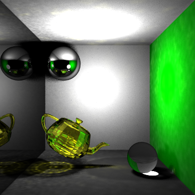
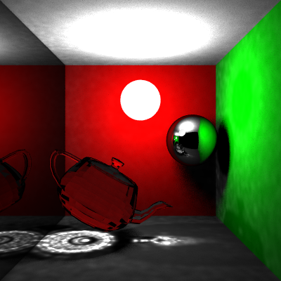
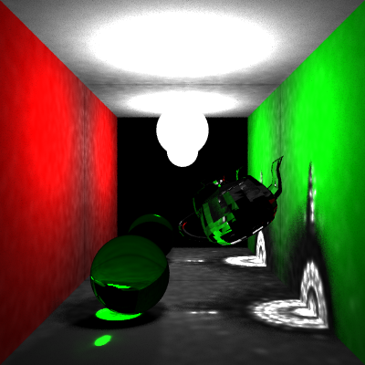
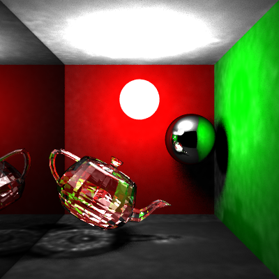
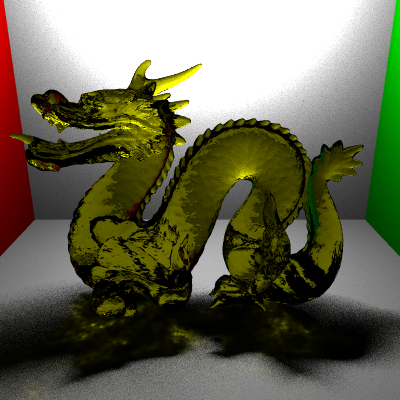
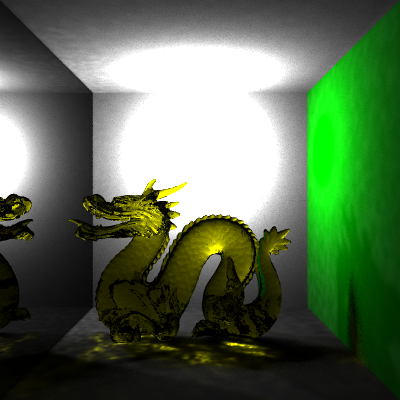
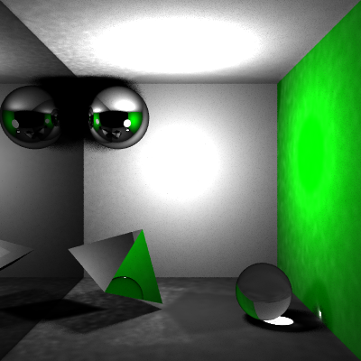
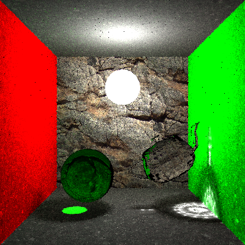
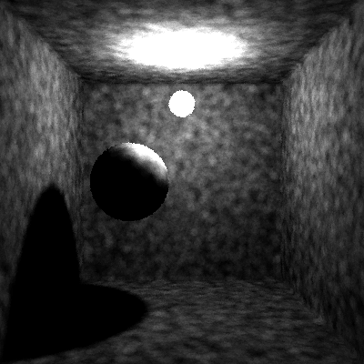
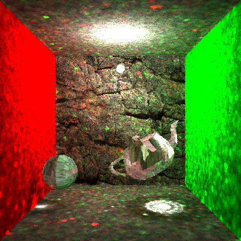

# Photon Mapping

Personal Computer Graphics Project: Physically Based Rendering. 

## Renders
Yellow glass teapot, specular transmissive sphere and reflective wall

Glass material is implemented using weighted-material combined with specular transmission and specular reflection.

------
Specular transmission teapot

Teapot is perfectly tramsmissive, the caustic effect can be well captured using photon mapping.

Transmissive teapot and reflective back wall 

------
White glass teapot

------
Yellow glass dragon and mirron wall(reflective)

------
Prism with 80% reflection and 20% transmission material

Both caustic and reflective effects can be captured in this test scene.

## IN PROGRESS 
Final gathering for indirect lighting

## Debug Renders
Test for kd-tree and photon shooting tasks

------
Render with radiance map ONLY

